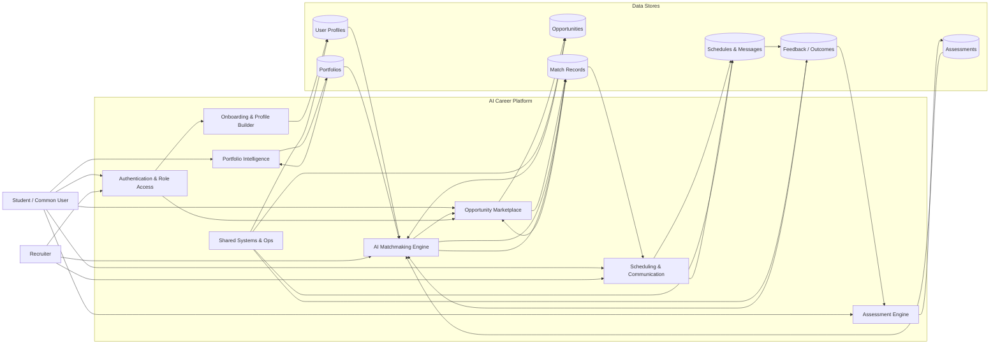
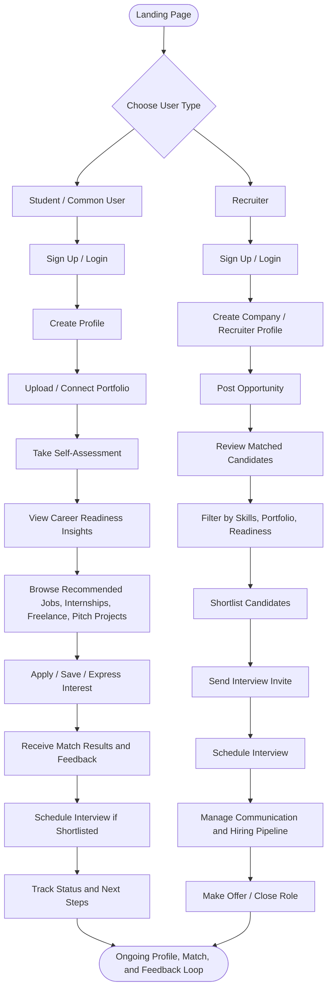

# Project Diagrams

## Common Data Flow Diagram

```mermaid
flowchart LR
  Student[Student / Common User]
  Recruiter[Recruiter]

  subgraph Platform["AI Career Platform"]
    Auth[Authentication & Role Access]
    Onboarding[Onboarding & Profile Builder]
    Portfolio[Portfolio Intelligence]
    Assessment[Assessment Engine]
    Match[AI Matchmaking Engine]
    Jobs[Opportunity Marketplace]
    Schedule[Scheduling & Communication]
    Admin[Shared Systems & Ops]
  end

  subgraph Data["Data Stores"]
    UDB[(User Profiles)]
    PDB[(Portfolios)]
    ADB[(Assessments)]
    ODB[(Opportunities)]
    MDB[(Match Records)]
    SDB[(Schedules & Messages)]
    FDB[(Feedback / Outcomes)]
  end

  Student --> Auth
  Auth --> Onboarding
  Onboarding --> UDB
  Student --> Portfolio
  Portfolio --> PDB
  Student --> Assessment
  Assessment --> ADB
  Student --> Jobs
  Jobs --> MDB
  Match --> Jobs
  Match --> MDB
  Student --> Schedule
  Schedule --> SDB

  Recruiter --> Auth
  Auth --> Jobs
  Jobs --> ODB
  Recruiter --> Match
  Match --> MDB
  Recruiter --> Schedule
  Schedule --> SDB

  UDB --> Match
  PDB --> Portfolio
  PDB --> Match
  ADB --> Match
  ODB --> Match
  MDB --> Jobs
  MDB --> Schedule
  SDB --> FDB
  FDB --> Assessment
  FDB --> Match

  Admin --> UDB
  Admin --> ODB
  Admin --> SDB
  Admin --> FDB
```

## User Flow Diagram

```mermaid
flowchart TD
  Start([Landing Page]) --> Role{Choose User Type}

  Role --> StudentPath[Student / Common User]
  Role --> RecruiterPath[Recruiter]

  StudentPath --> S1[Sign Up / Login]
  S1 --> S2[Create Profile]
  S2 --> S3[Upload / Connect Portfolio]
  S3 --> S4[Take Self-Assessment]
  S4 --> S5[View Career Readiness Insights]
  S5 --> S6[Browse Recommended Jobs, Internships, Freelance, Pitch Projects]
  S6 --> S7[Apply / Save / Express Interest]
  S7 --> S8[Receive Match Results and Feedback]
  S8 --> S9[Schedule Interview if Shortlisted]
  S9 --> S10[Track Status and Next Steps]

  RecruiterPath --> R1[Sign Up / Login]
  R1 --> R2[Create Company / Recruiter Profile]
  R2 --> R3[Post Opportunity]
  R3 --> R4[Review Matched Candidates]
  R4 --> R5[Filter by Skills, Portfolio, Readiness]
  R5 --> R6[Shortlist Candidates]
  R6 --> R7[Send Interview Invite]
  R7 --> R8[Schedule Interview]
  R8 --> R9[Manage Communication and Hiring Pipeline]
  R9 --> R10[Make Offer / Close Role]

  S10 --> End([Ongoing Profile, Match, and Feedback Loop])
  R10 --> End
```
